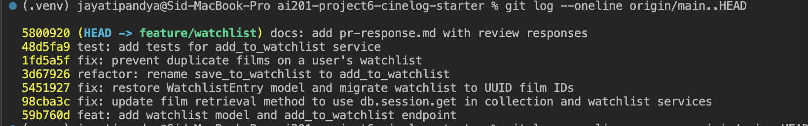

# PR Response Doc — CineLog Watchlist Feature

## AI Usage

I did use an AI assistant on this, and here's exactly where and how:

- **Getting oriented.** Before I changed anything, I had it walk me through `models.py`, `collection_service.py`, and `test_collection.py`, plus the branch/commit layout, so I understood the existing patterns first. I checked what it told me against the real code — for example, I confirmed `add_to_collection()` raises `AlreadyInCollectionError` on a duplicate rather than quietly returning, so I could copy that behavior.
- **Drafting this doc.** I used it to help structure this file and to draft the factual write-ups for Comments 1, 2, 3, and 6, then edited those to match what I actually did.
- **The two design calls (Comments 4 and 5).** I made these decisions myself. I wrote my positions first, then asked the AI to argue against me like a picky reviewer would. It pushed back that a watchlist leaks _future intent_ (arguably more sensitive than a collection of things you've already watched), and that "users can just opt out" doesn't count for much when there's no UI to do it. I kept both positions but tightened the wording.
- **Git hygiene.** I had it sanity-check my commit messages against Conventional Commits and walk me through the interactive rebase.

## Comment 1 — Rename

**What I did:**
The reviewer was right that `save_to_watchlist()` stuck out. Everything else in the service layer follows the `verb_to_noun` pattern — `add_to_collection()`, `remove_from_collection()`, `get_collection()` — and `CONTRIBUTING.md` calls that convention out explicitly, so `save_` was the odd one. I renamed it to `add_to_watchlist()` in `services/watchlist_service.py`. There was only one caller, in `routes/watchlist/watchlist.py`, and I updated both the `import` at the top and the call inside `add_film()`.

**How I verified:**
I ran `grep -rn "save_to_watchlist" .` across the project (and used my editor's find-all-references) to make sure nothing still pointed at the old name — it came back empty. Then `pytest tests/ -v` to confirm the rename didn't break anything.

## Comment 2 — Deduplication

**What I did:**
I followed the exact approach `add_to_collection()` already uses. After I check that the film exists, I look for an existing `WatchlistEntry` with the same `(user_id, film_id)`. If one's already there, I raise a new `AlreadyInWatchlistError` instead of writing a second row — that mirrors `AlreadyInCollectionError`. The route turns that into a `409 Conflict`. There's also a `UniqueConstraint("user_id", "film_id")` on the model as a database-level safety net, the same as `CollectionEntry` has.

**How I verified:**
`test_add_to_watchlist_duplicate_raises` adds the same film twice, checks that the second call raises `AlreadyInWatchlistError`, and then confirms only one row actually made it into the DB (`count == 1`).

## Comment 3 — Missing test

**What I did:**
I added `tests/test_watchlist.py`, built the same way as `test_collection.py` — the same `app` fixture on an in-memory SQLite DB, plus `sample_user` and `sample_film`. The one the reviewer specifically asked for is `test_add_to_watchlist_nonexistent_film_raises`, which is basically the watchlist version of `test_add_to_collection_nonexistent_film_raises`: pass a `film_id` that doesn't exist and expect `FilmNotFoundError`, not some raw DB integrity error. While I was in there I also added a happy-path test, the duplicate test above, and a sort-order test.

**How I verified:**
`pytest tests/test_watchlist.py -v` passes, and the full suite comes back at 8 passing. I made sure the fake id is a UUID string (`"00000000-0000-0000-0000-000000000000"`) so it matches the post-refactor UUID schema instead of an integer.

## Comment 4 — Default visibility

**My position:**
I'm leaning toward keeping the `public=True` default for `WatchlistEntry.public`.

**Reasoning:**
Since CineLog is built around community and sharing taste in films, a watchlist is naturally a social feature. It's basically saying "here's what I plan to watch." The feature is a lot more valuable when friends can actually see it to give recommendations or discover new movies. Defaulting to public matches how most people are going to use the app, so sharing isn't an extra step they have to remember. And the `public` column is right there, so the smaller group of people who want a private list can just switch it off.

**Tradeoffs:**
I definitely get that the safer move is `public=False` (privacy-by-default). "Public unless you opt-out" can catch people off guard if they were expecting a private notepad. But I think it's worth accepting that slight privacy friction to encourage the social behavior that actually makes CineLog unique. To make sure no one is genuinely surprised, we should pair this with a clear UI indicator and an easy toggle on the frontend.

## Comment 5 — Sort order

**My position:**
I'd prefer to keep the watchlist sorted alphabetically by title (`Film.title.asc()`) instead of switching it to date-added.

**Reasoning:**
My take is that the two list endpoints serve fundamentally different purposes, so their sorting should reflect that. `get_collection()` acts like a history log of what you've already watched, and recency is super important there, so `date_added` descending makes perfect sense. A watchlist, though, is more like a menu you browse when trying to pick what to watch next. Alphabetical order gives every film a stable, predictable spot. If we use date-added, the list reshuffles every time you add a movie, and you can't easily skim it for a specific title.

**Addressing the consistency point:**
I totally hear the argument for making this match `get_collection` so the API is predictable for callers, and I don't want to dismiss that. But I think forcing the same sort just to match endpoints makes the watchlist act too much like an activity feed. If we sort newest-first, the movies you added months ago (that you still want to watch!) get buried at the bottom. Down the road, date-added would be a great secondary sort option in the UI, but for the default, alphabetical just fits the "pick a movie" use case better. I went ahead and pinned this with `test_get_watchlist_returns_alphabetical_by_title` so it won't silently break on us later.

## Comment 6 — Rebase

**What conflicted:**
While my PR was open, the integer→UUID refactor got merged into `main` (`refactor: migrate film IDs from integer to UUID`). It changed `Film.id` and every `film_id` foreign key from `Integer` to `String(36)` UUIDs. My branch was still treating `WatchlistEntry.film_id` as an integer and looking films up the old integer way (`Film.query.get(...)`). So when I rebased `feature/watchlist` onto `origin/main`, it conflicted in `models.py` (the `film_id` column type) and `services/watchlist_service.py` (the film lookup).

**How I resolved it:**
I went with `main`'s UUID version. `WatchlistEntry.film_id` is now `db.String(36)` with a `ForeignKey("film.id")`, matching `CollectionEntry`, and the lookup uses `db.session.get(Film, film_id)` with no int cast. I also switched the fake id in my test to a UUID string. I rebased instead of merging, so no merge commit was created.

**How I verified no conflict remains:**
`git log --oneline --merges origin/main..HEAD` comes back empty (no merge commits), `git log --graph --oneline` shows a linear history, and `pytest tests/ -v` still passes end to end with UUIDs. The branch replays cleanly on top of `origin/main`.

## PR Description

<!-- This same text goes in the GitHub PR description box. -->

### What this feature does

This adds a **watchlist** — a list of films a user _wants_ to watch, kept separate from their **collection** (films they've already watched and logged). It ships two endpoints:

- `GET /watchlist/<user_id>` — returns the user's watchlist, sorted alphabetically by title.
- `POST /watchlist/<user_id>/add` with body `{ "film_id": "<uuid>" }` — adds a film, rejecting duplicates (`409`) and unknown film ids (`404`).

It's backed by a new `WatchlistEntry` model with a per-entry `public` visibility flag and a `(user_id, film_id)` uniqueness constraint.

### Design decisions

1. **Visibility defaults to public (`public=True`).** CineLog is community-first, so I default watchlists to visible to lean into discovery and sharing. I know that trades off some privacy, so the intent is to pair it with a clear indicator and an easy per-entry toggle. (Full reasoning in Comment 4.)
2. **The list sorts alphabetically by title, not date-added.** A watchlist is a browse-to-pick menu, unlike the collection's chronological log, so a stable alphabetical order fits how it's actually read. (Full reasoning in Comment 5.)

### How to manually test

The database starts empty and there's no endpoint for creating films or users, so seed one of each first through the Flask shell:

```bash
source .venv/bin/activate
python
```

```python
from app import create_app, db
from models import User, Film
app = create_app()
with app.app_context():
    u = User(username="ada", email="ada@example.com")
    f = Film(title="Paddington 2", year=2017, genre="Comedy")
    db.session.add_all([u, f]); db.session.commit()
    print("USER_ID =", u.id)
    print("FILM_ID =", f.id)
```

Then, with the app running (`python app.py`) in another terminal, drop in the printed ids:

```bash
# Add the film to the watchlist -> 201 Created
curl -s -X POST http://127.0.0.1:5000/watchlist/<USER_ID>/add \
  -H "Content-Type: application/json" -d '{"film_id":"<FILM_ID>"}'

# View the watchlist -> the film shows up
curl -s http://127.0.0.1:5000/watchlist/<USER_ID>

# Add the same film again -> 409 Conflict (dedup works)
curl -s -X POST http://127.0.0.1:5000/watchlist/<USER_ID>/add \
  -H "Content-Type: application/json" -d '{"film_id":"<FILM_ID>"}'

# Add a film id that doesn't exist -> 404 Not Found
curl -s -X POST http://127.0.0.1:5000/watchlist/<USER_ID>/add \
  -H "Content-Type: application/json" \
  -d '{"film_id":"00000000-0000-0000-0000-000000000000"}'
```

Or just run the test suite: `pytest tests/ -v` (8 passing).

## Commit history

`git log --oneline origin/main..HEAD` on `feature/watchlist` after the interactive rebase — seven conventional commits, one logical change each, no merge commits:


